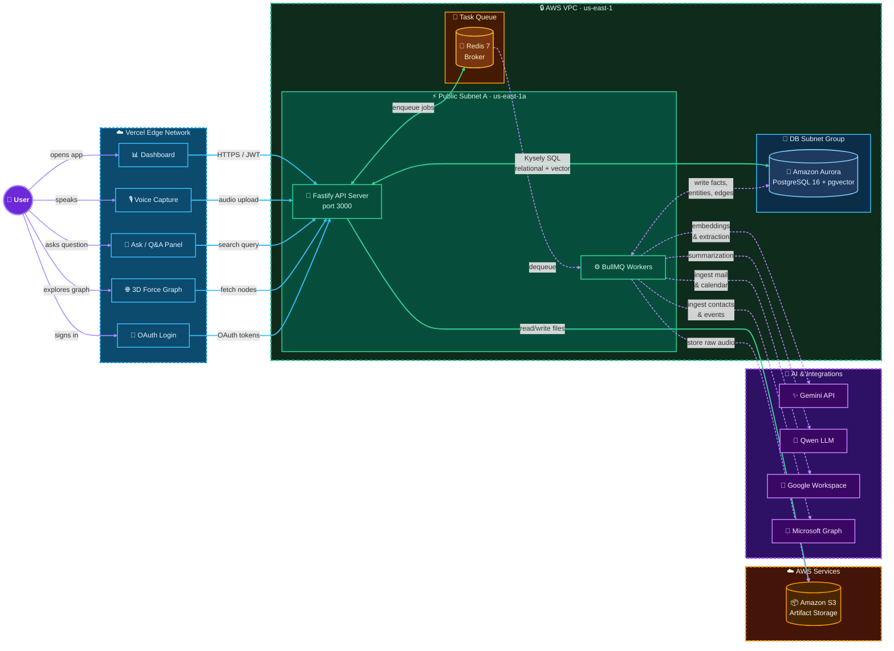

# Project Mnemosyne

**Project Mnemosyne** is a personal AI memory system. It ingests your data (notes, Gmail, Calendar, Contacts, voice recordings), structures it into a queryable semantic memory graph (comprising episodes, facts, entities, and relationships), and exposes it via grounded Q&A, interactive 3D relationship tracking, and proactive agent briefings.

Its guiding principle: **"Build the memory, not the notebook — discipline to forget, humility to cite, courage to interrupt."**

---

## 🏗️ System Architecture

The following diagram illustrates how the system components connect:



---

## 📦 Project Layout

Project Mnemosyne is split into two self-contained packages:

*   📁 **[`app/`](app/README.md) (Frontend)**: A Next.js 16 (App Router) + React 19 web interface utilizing Tailwind CSS v4 and an interactive 3D Force-Directed Graph (Three.js) to display your relationship network.
*   📁 **[`services/`](services/README.md) (Backend)**: A Node.js + TypeScript Fastify API server and BullMQ background task worker running on PostgreSQL 16 + pgvector and Redis.

---

## 🚀 Quick Start (Running Locally)

To spin up the entire project locally, follow these steps:

### 1. Backend Setup
1. Change into the backend directory and configure the environment:
    ```bash
    cd services
    cp .env.example .env
    ```
2. Start the local database and redis containers:
    ```bash
    pnpm infra:up
    ```
3. Initialize the PostgreSQL schema:
    ```bash
    pnpm db:reset
    ```
4. Start the API and Worker processes in separate terminals:
    ```bash
    pnpm api      # Starts Fastify API on http://localhost:3000
    pnpm worker   # Starts BullMQ worker processors
    ```

### 2. Frontend Setup
1. In another terminal, navigate to the frontend directory:
    ```bash
    cd app
    cp .env.example .env.local
    ```
2. Install dependencies and start the dev server:
    ```bash
    pnpm install
    pnpm dev      # Starts Next.js frontend on http://localhost:3001
    ```

Open your browser to [http://localhost:3001](http://localhost:3001) to interact with the application.
